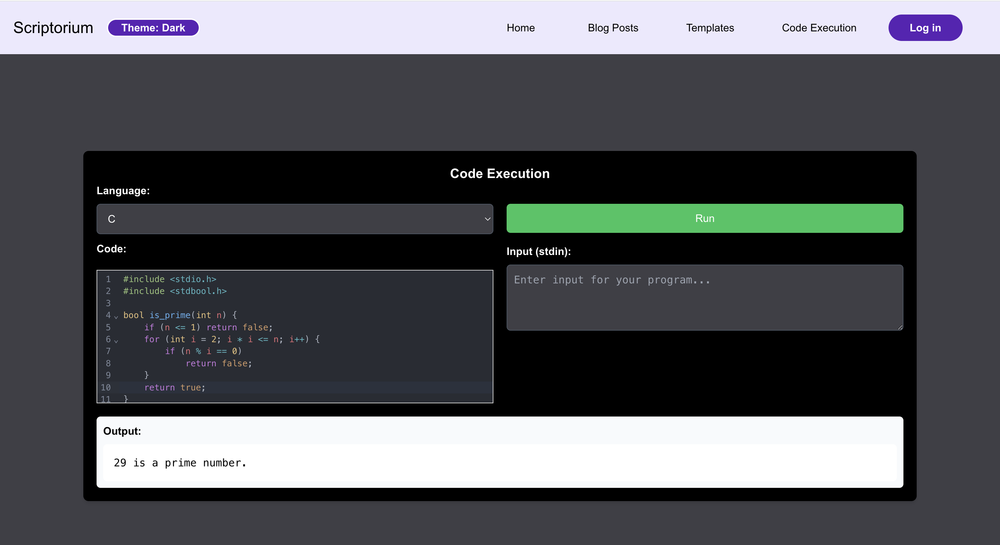
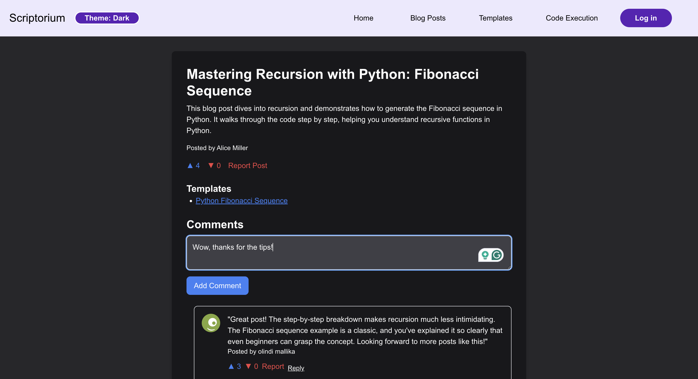
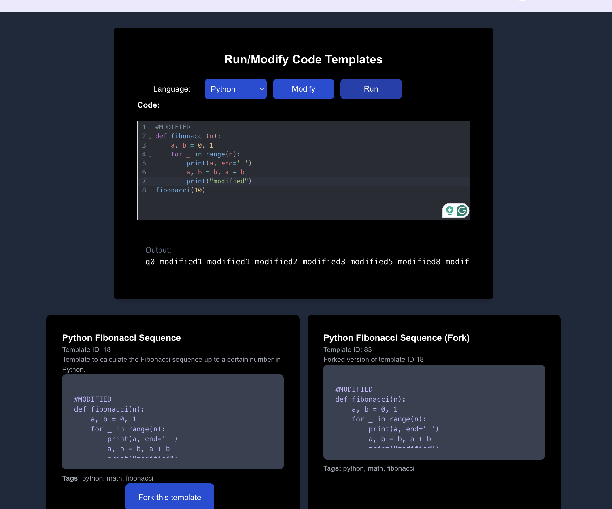

# 🚀 Scriptorium

[](https://nextjs.org/)
[](https://reactjs.org/)
[](https://www.typescriptlang.org/)
[](https://www.docker.com/)
[](LICENSE)

> **A platform for new developers to code, blog, and share their learning journey!** 

---

## 📋 Table of Contents
- [🎯 Project Overview](#project-overview)
- [🚀 Getting Started](#getting-started)
- [⭐ Key Features](#key-features)
- [🛠️ Tech Stack](#tech-stack)
- [🔌 API Examples](#api-examples)
- [🗺️ Roadmap](#roadmap)
- [🤝 Contribution Guidelines](#contribution-guidelines)

---

## 🎯 Project Overview

**Scriptorium** is a full-stack application that allows new coders to:

- **Write and execute code** in multiple programming languages securely using Docker containers. &#8628;


- **Blog about coding topics** and interact with a developer community by commenting and liking. &#8628;


- **Create, share, and discover code templates** for personal learning and sharing progress. &#8628;


🎬 **Video Demo:** [https://drive.google.com/file/d/1ptSbtoSexOckM0dMTFxNAyOIjOS4vjVJ/view?usp=sharing](https://drive.google.com/file/d/1ptSbtoSexOckM0dMTFxNAyOIjOS4vjVJ/view?usp=sharing)

### 💡 Motivation
Scriptorium was built to provide a single platform for new developers to blog their coding journey and learn by doing!

---

## 🚀 Getting Started

### 📋 Prerequisites
- **Node.js** 18+
- **npm** 9+ or **yarn** 1.22+
- **Docker** 20+ (for code execution)
- **Git** 2.30+

### ⚡ Quick Setup
Run this command in your terminal after cloning the repository:

```bash
chmod +x startup.sh && ./startup.sh && chmod +x run.sh && ./run.sh
```

> ** Running this script will install all dependencies, set up the database, build Docker images, and start the server for you!**

Visit **[http://localhost:3000](http://localhost:3000)** to get started!

---

## ⭐ Key Features

| Feature | Description |
|---------|-------------|
| **Secure Code Execution** | Code execution in multiple languages inside secure Docker containers |
| **Template Management** | Create, fork, and share code templates |
| **Blogging Platform** | Blog with comments and ratings |
| **User System** | Authentication and profiles |
| **Content Moderation** | Reporting, moderation and Admin tools |
| **Advanced Search** | Search and discovery of blogs and templates |
| **Theme Support** | Light/dark mode design |

---

## 🛠️ Tech Stack

### 🎨 Frontend
- **[Next.js 14](https://nextjs.org/)** - React framework with App Router
- **[React 18](https://reactjs.org/)** - UI library
- **[TypeScript 5.7.2](https://www.typescriptlang.org/)** - Type-safe JavaScript
- **[Tailwind CSS 3.4.15](https://tailwindcss.com/)** - Utility-first CSS framework
- **[CodeMirror 6.0.2](https://codemirror.net/)** - Code editor with syntax highlighting

### ⚙️ Backend
- **Next.js API Routes** - Serverless API endpoints
- **[Prisma ORM 5.21.1](https://www.prisma.io/)** - Type-safe database operations
- **[SQLite](https://www.sqlite.org/)** - Database
- **[JWT](https://jwt.io/)** - Authentication
- **[Bcrypt](https://github.com/dcodeIO/bcrypt.js/)** - Password hashing

### 🐳 Code Execution
- **[Docker](https://www.docker.com/)** - Containerized execution environments
- **Multiple language runtimes** (Python, JavaScript, C++, Java, Go, PHP, Rust, SQL, Ruby, C#, C)

### 🛠️ Development
- **[ESLint](https://eslint.org/)** - Code linting
- **[PostCSS](https://postcss.org/)** - CSS processing

---

## 🔌 API Examples

> **API Test Points from [Postman API Testing Suite](https://github.com/olindimallika/Scriptorium/blob/main/postman-api-testing-suite.json)**

### Authentication

#### Sign Up (Regular User)
```bash
curl -X POST http://localhost:3000/api/accounts/sign-up \
  -H "Content-Type: application/json" \
  -d '{
    "firstName": "Test",
    "lastName": "This",
    "email": "example1@example.com",
    "password": "password123",
    "avatar": "/avatars/avatar1.png",
    "phoneNumber": "123-456-7890"
  }'
```

**Response:**
```json
{
  "message": "User created successfully",
  "user": {
    "id": 13,
    "firstName": "Test",
    "lastName": "This",
    "email": "example1@example.com",
    "avatar": "/avatars/avatar1.png",
    "phoneNumber": "123-456-7890"
  }
}
```


### Code Execution

#### Execute Code with Input
```bash
curl -X POST http://localhost:3000/api/code-writing-and-execution/input \
  -H "Content-Type: application/json" \
  -d '{
    "code": "print(input())",
    "language": "python",
    "input": "Hello World!"
  }'
```

**Response:**
```json
{
  "output": "Hello World!\n",
  "error": ""
}
```

### Code Templates

#### Search Saved Templates
```bash
curl -X POST "http://localhost:3000/api/code-templates/search-saved?userId=2" \
  -H "Authorization: Bearer {{accessToken}}" \
  -H "Content-Type: application/json" \
  -d '{
    "query": "Python"
  }'
```

#### Run and Modify Template
```bash
curl -X POST http://localhost:3000/api/code-templates/run-modify \
  -H "Authorization: Bearer {{accessToken}}" \
  -H "Content-Type: application/json" \
  -d '{
    "templateId": 3,
    "modifiedCode": "console.log(\"testing template 3 fork save!\");",
    "saveAsFork": true
  }'
```

### Blog Posts

#### Create Blog Post
```bash
curl -X POST http://localhost:3000/api/blog-posts/create-blog \
  -H "Authorization: Bearer {{accessToken}}" \
  -H "Content-Type: application/json" \
  -d '{
    "title": "New: Introduction to JavaScript",
    "description": "This blog post provides an introduction to JavaScript, covering the basics of the language.",
    "tags": ["javascript", "basics", "programming"],
    "templateIds": [1, 2]
  }'
```

#### Delete Blog Post
```bash
curl -X DELETE http://localhost:3000/api/blog-posts/create-blog \
  -H "Authorization: Bearer {{accessToken}}" \
  -H "Content-Type: application/json" \
  -d '{
    "id": 7
  }'
```

### Comments & Ratings

#### Create Reply to Comment
```bash
curl -X POST http://localhost:3000/api/blog-posts/create-comment \
  -H "Authorization: Bearer {{accessToken}}" \
  -H "Content-Type: application/json" \
  -d '{
    "content": "Nice post!",
    "blogPostId": 2,
    "parentId": 4,
    "rating": 5
  }'
```

#### Rate Blog Post
```bash
curl -X POST http://localhost:3000/api/blog-posts/ratings \
  -H "Authorization: Bearer {{accessToken}}" \
  -H "Content-Type: application/json" \
  -d '{
    "blogPostId": 10,
    "isUpvote": true
  }'
```

**Response:**
```json
{
  "message": "Blog post rating updated successfully!",
  "upvotes": 1,
  "downvotes": 2
}
```

### Content Moderation

#### Report Blog Post
```bash
curl -X POST http://localhost:3000/api/icr/report \
  -H "Authorization: Bearer {{accessToken}}" \
  -H "Content-Type: application/json" \
  -d '{
    "blogPostId": 4,
    "reason": "The blog has harmful intent."
  }'
```

#### Hide Content (Admin Only)
```bash
curl -X PUT http://localhost:3000/api/icr/hide-content \
  -H "Authorization: Bearer {{accessToken}}" \
  -H "Content-Type: application/json" \
  -d '{
    "blogPostId": 2
  }'
```

---

### Future Improvements
- Deploy using **Vercel** so multiple people can share their progress!

---

> **For future contributions:** 
### Code Style
- Follow the existing code style
- Add comments for large blocks of logic
- Write meaningful commit messages
- Test your changes through Postman test suite

---

<div align="center">

[](https://github.com/yourusername/scriptorium)
[](https://github.com/yourusername/scriptorium)

</div>


